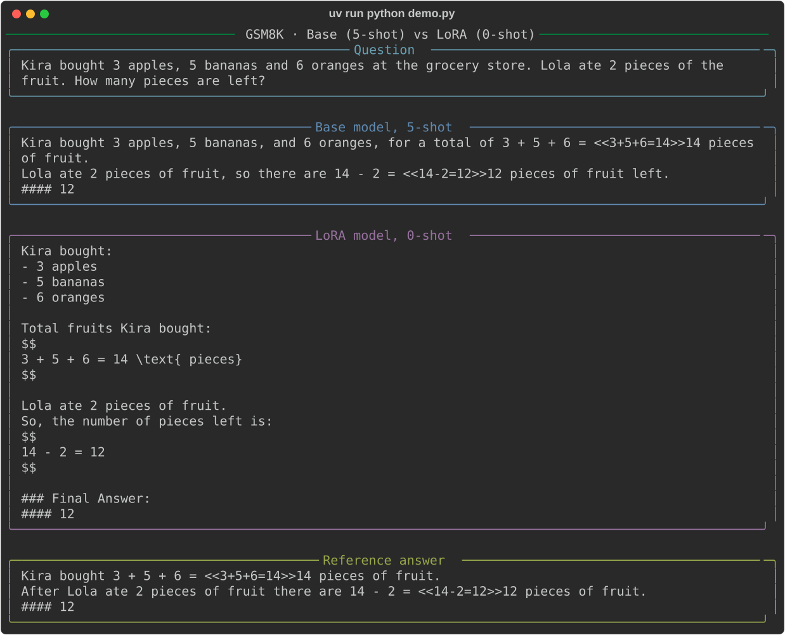

# GSM8K SFT with LoRA

Fine-tune Qwen3-0.6B-Base on GSM8K with LoRA and MLX-LM, and measure the effect
against a fair baseline.

The training data is not the original GSM8K answers but step-by-step solutions
distilled from a larger teacher (Qwen3-4B). In earlier runs, fine-tuning on the
original answers reached 51% zero-shot, indistinguishable from the base model with
5-shot prompting (49%): the base model has already seen GSM8K during pretraining,
so those answers carry no new information. Detailed teacher solutions do.

```
prepare_data.py   GSM8K → data/{train,valid,test}.jsonl
distill.py        Qwen3-4B solutions → data/distill/{train,valid}.jsonl
train.py          LoRA, one epoch, loss on the answer only → adapters/
evaluate.py       base vs LoRA on the test set → outputs/
demo.py           one random question, side by side
```

## Setup

From the repository root:

```bash
uv sync --locked
cd sft/gsm8k
```

## 1. Prepare data

```bash
uv run python prepare_data.py
```

Split the official [GSM8K](https://huggingface.co/datasets/openai/gsm8k) (`main`)
training set 90/10 for training and validation (seed `42`), and keep the official
test set. Each line is `{"question": ..., "answer": ...}` with the original text.

| File               | Examples |
| ------------------ | -------: |
| `data/train.jsonl` |    6,725 |
| `data/valid.jsonl` |      748 |
| `data/test.jsonl`  |    1,319 |

## 2. Distill teacher solutions

```bash
uv run python distill.py            # about an hour on an M-series Mac
uv run python distill.py --limit 8  # smoke test
```

Qwen3-4B (non-thinking mode, Qwen's recommended sampling settings, seed `0`)
solves every training and validation question. A solution is kept only if its
final answer matches the gold answer and it is at most 1,024 tokens; about 88%
survive. Every kept solution ends with `#### <number>`, the GSM8K convention,
so the student learns it too. Output has the same format as `data/`.

## 3. Train

```bash
uv run python train.py
```

Reads `config.yaml` and runs MLX-LM's LoRA training loop for exactly one epoch
over `data/distill` (about 185 steps of 32 examples). Only the answer tokens and
the final `<|endoftext|>` contribute to the loss, not the question. `mlx_lm.lora`
can mask the prompt only when it applies a chat template, which the base model has
never seen, so `train.py` builds the plain-text examples itself. Validation loss is
reported every 50 steps; the adapter is saved to `adapters/`.

## 4. Evaluate

```bash
uv run python evaluate.py --shots 5   # base model, 5-shot: the fair baseline
uv run python evaluate.py --adapter   # fine-tuned model, zero-shot
uv run python evaluate.py             # base model, zero-shot, for reference
```

Every prompt is plain text, with no chat template and no instruction:

```
Question: <question>
Answer:
```

A base model has no reason to use `#### <number>` or to stop after answering, so
its zero-shot score mostly measures format, not math. `--shots 5` prepends the
first five training examples as worked demonstrations, which is the standard way
to evaluate a base model; the fine-tuned model is compared against that number.

Greedy decoding, up to 1,024 new tokens, batches of 128. Add `--limit 20` for a
short run. Text after the first generated `Question:` is discarded before scoring,
because a base model tends to continue by inventing new problems.

Each run reports:

- **Strict accuracy**: the number after `####` equals the gold answer.
- **Flexible accuracy**: also accepts "the answer is N" or the last number in the response.
- **Format compliance**: fraction of responses containing `#### <number>`.
- **Truncated**: fraction of responses that hit the token limit.

Per-example predictions and scores go to `outputs/{base,lora}-{N}shot.jsonl`.

## 5. Demo

```bash
uv run python demo.py                  # random test question, base vs LoRA
uv run python demo.py --save demo.svg  # also save the output as an image
```



The base model often gets the number right but does not know when to stop; the
fine-tuned model answers in the teacher's structured style and ends with `#### <number>`.

## Results

Qwen3-0.6B-Base, all 1,319 test questions, one epoch of training (185 steps of 32).

| Model                    | Strict accuracy | Flexible accuracy | Format compliance |
| ------------------------ | --------------: | ----------------: | ----------------: |
| Base, 0-shot             |           0.00% |            14.86% |             0.15% |
| Base, 5-shot             |          48.90% |            50.34% |            95.53% |
| LoRA (distilled), 0-shot |      **68.01%** |        **68.08%** |            98.10% |

Fine-tuning adds **19.1 points** of strict accuracy over the 5-shot base model.
The two differ on 446 questions: LoRA is right and Base wrong on 349, the reverse
on 97 (McNemar exact test, p < 10⁻³³). Truncation is 1.3% for both.

The base model's zero-shot 0% is a format failure, not a math failure: with five
demonstrations the same weights score 48.9%. That is why the 5-shot number is the
baseline. The distilled teacher solutions keep 88% of the training questions
(5,932 of 6,725); validation loss went from 0.644 to 0.201 over the epoch.
